# The Babylon Portfolio Lite - Capital Rift Market Pilot

A read-only Chrome extension for tracking your Capital Rift stock portfolio, with live analytics in a Quest Trade-inspired 8-bit retro UI.


> **Lite edition** — a read-only viewer. Everything the Premium edition has, except the Discord webhook integration and every trading action.
>
> You **cannot** buy or sell shares, place or cancel orders, or bid on IPOs from this build. There is no Trade tab: the extension never sends a mutation to the game API. Trades you make on the Capital Rift website are still detected, logged in the History tab, and reflected in your holdings — the extension only watches. For Discord alerts on top of the same read-only tracker, use the Premium edition.

## Features

### Portfolio Management
- **Real-time Portfolio Value** - Track your total holdings value with 24h progress indicators
- **Live Market Tape** - Wall-Street style ticker crawling across the very top of the popup, above the logo: every listed company as ticker · name · price · 24h change, colour-coded green / red / amber, with a pulsing **LIVE** badge (it falls back to **STALE** when the last poll ages out) and a `N listed · X up · Y down` board count. The ticker sign is derived from the company name — the game exposes no symbol field. Crawl speed is derived from the width of the whole listing board instead of being fixed, so **every** stock crosses the window on each loop: a small market keeps the slow, calm pace and a large one runs faster (capped at the point a ticker stops being readable). The tape rides the existing portfolio poll instead of adding requests of its own: prices are patched in place so the crawl never restarts, a cell flashes the colour of its move, hovering pauses the tape so a quote can be read, and it holds still when the OS asks for reduced motion. Hidden when the market has no listings
- **Liquid Money Bar** - Topbar strip under the portfolio summary totalling your liquid assets: personal cash, personal bank accounts, and each founded company's main till, revenue share and bank/savings accounts, drawn as a proportional breakdown with per-source value chips (hover a company chip for its Main / Revenue / Bank split). The bar re-reads every one of those balances **every 5 seconds** while the popup is open — the green **live** badge in the bar shows the figures are current. Only the company you are piloting can be read through the game API, so a company you are not piloting shows its bank accounts projected from the last snapshot at the account interest rate, and its chip says which (`seen 2h ago`, `pilot company to track`)
- **Holdings Overview** - View all owned shares with current prices and yields
- **Dividend Tracking** - Monitor expected annual dividends from your portfolio, with totals and a per-company breakdown on the Dividends tab
- **Portfolio Value Chart** - Visualize portfolio performance over time (1H, 24H timeframes)
- **Search & Filter** - Quickly find any company in the Overview and Holdings tables

### Market Tracking
- **Order Book** - View live bids and asks with spread information
- **Order Monitor** - See every open order and when it was placed
- **Transaction History** - Complete log of the trades, orders and IPO bids detected on your account
- **Read-Only Guarantee** - No buy, sell, cancel or bid action exists anywhere in the interface or the service worker

### Analytics
- **Advanced Analytics** - Deep dive into market data with interactive charts
- **Sector Map** - Color-coded treemap of the market grouped into sectors, with tile size weighted by market cap
- **Stock Market Info** - Fourteen aggregate cards under the sector map: total market cap, your share of it, your holdings value, listed and owned counts, 24h average change, gainers vs losers, cap-weighted market yield, total shares, total investors, total backing, plus the largest company, top gainer and top loser
- **Sector Breakdown Table** - Per-sector row with company count, market cap, share of the whole market and your own stake in it, totalled across the market below the cards
- **Multiple Timeframes** - Analyze trends across 1H and 24H periods
- **Company Details** - Comprehensive view of each company's performance
- **Spark Data Visualization** - Historical price movements at a glance

### Market Access
- **IPO Board** - Watch upcoming and live offerings and track the bids on your account
- **Market Overview** - Sortable table of all available companies
- **Market Analysis** - Scan the whole item exchange and list every commodity with its price, 24h change, base price, spread, NPC quotes, best bid/ask, book depth, trend and volume
- **Filter Options** - Sort by value, yield, price, and more

### Economy Dashboard
- **World Economy** - Game-day macro stats, cash supply, and live commodity quotes
- **Income Engine** - Every income rate that feeds your daily cash flow
- **Cash Flow Chart** - Daily inflow vs outflow over time
- **Income Sources** - Ranked list of where your money comes from
- **Payroll & Costs** - What leaves your account each day
- **Bank Accounts** - Balances and recent account activity (read-only — transfers happen in the game)
- **Companies & Equity** - Your stake in every company you own
- **Leaderboards** - Wealth and loyalty boards
- **Market Pulse** - Scan breadth with top gainers and losers

### UI/UX
- **Retro 8-bit Design** - Quest Trade-inspired pixel art aesthetic
- **Responsive Layout** - Optimized for 800x600 popup and full browser tab
- **Toast Notifications** - Real-time feedback on all actions
- **Smooth Animations** - Polished transitions and interactions
- **Boot Intro** - Terminal-style splash on open with a stepped boot log and market ticker; skips on the first click or key press

### Remote Access
- **Mobile Portfolio Viewer** - Access your portfolio from any device via hosted URL
- **Vercel Serverless API** - Secure data relay with token authentication
- **Auto-Sync** - Portfolio data automatically syncs when fetched in extension
- **Auto-Refresh** - Remote viewer updates every 60 seconds
- **Sector Map & Market Totals** - The same color-coded treemap is on the remote viewer page, scaled to your screen size and followed by the stock market overview cards and per-sector breakdown

## Installation

### From Source

1. Extract the downloaded ZIP to a permanent folder (Chrome loads the extension from disk, so do not delete it afterwards), or clone the repository:

   ```bash
   git clone https://github.com/weblynxcreation/The-Babylon-Portfolio-Final.git
   ```

2. Open Chrome (or any Chromium browser) and navigate to `chrome://extensions/`

3. Enable **Developer mode** (toggle in top-right corner)

4. Click **Load unpacked** and select the extracted extension directory

5. The Babylon Portfolio icon should appear in your browser toolbar

### Loading the Extension

- Click the extension icon to open the popup (800x600)
- Click **⤢ Full Tab** to open in a full browser window for expanded view

## Usage

### Getting Started

1. **Navigate to Capital Rift** - Visit `https://play.capitalrift.com/`
2. **Open the Extension** - Click the Babylon Portfolio icon in your toolbar
3. **View Overview** - See your portfolio summary and top holdings

### Where To Trade

Trading happens on the Capital Rift website, not in this extension. Buy and sell shares, place orders and bid on IPOs in the game itself — the extension picks the activity up on its next poll and files it under **History**.

### Following Orders

1. Navigate to the **Orders** tab
2. View every open order, its price, quantity and age
3. Orders disappear from the list once they fill or expire in-game

### Analyzing Performance

1. Open **Advanced Analytics** tab
2. Select a company to analyze
3. Choose timeframe (1H or 24H)
4. Review price charts and metrics

### Portfolio Chart

1. Go to **Holdings** tab
2. View the Portfolio Value chart at the top
3. Toggle between 1H and 24H timeframes
4. Monitor the progress indicator for performance trends

### Remote Access Setup

1. Deploy the remote viewer project (see [Remote Viewer Deployment](#remote-viewer-deployment))
2. Set up Vercel KV database in your project dashboard
3. Go to **Settings** tab in the extension
4. Enter your deployed Vercel URL in the **Remote API URL** field
5. Enable **Remote Access** — a secure token will be created
6. Copy the generated link and open it on any device

## Technical Details

### Architecture

- **Manifest V3** - Modern Chrome extension architecture
- **Service Worker** - Background script for API communication
- **Content Scripts** - Injected into Capital Rift for data access
- **Popup UI** - Main interface with modular panels

### Tech Stack

- **Frontend**: HTML5, CSS3, JavaScript (ES6+)
- **Charts**: Lightweight Charts by TradingView
- **Fonts**: Press Start 2P, JetBrains Mono, Inter
- **API**: Capital Rift Game API

### Permissions

- `storage` - Save user preferences and cached data
- `scripting` - Execute content scripts
- `activeTab` - Access current tab
- `alarms` - Schedule periodic data refresh
- `tabs` - Open full tab mode
- Host access to `play.capitalrift.com` (game API) and `*.vercel.app` (remote viewer)

### API Integration

The extension communicates with Capital Rift's API:
- `/api/me` - Player authentication and ID
- `/api/companies` - Market data and spark prices
- `/api/holdings` - Portfolio holdings
- `/api/orders` - Open order snapshot
- `/api/transactions` - Trade history
- `/api/dividends` - Dividend tracking

## Development

### Project Structure

```
The-Babylon-Portfolio-Lite/
├── manifest.json          # Extension manifest
├── popup.html             # Main UI (styles embedded)
├── popup.js               # Popup logic
├── background.js          # Service worker
├── content.js             # Content script
├── inject.js              # Page-context API bridge
├── remote.html            # Mobile portfolio viewer page
├── icons/                 # Extension icons
│   ├── brand-logo.png
│   ├── icon-16.png
│   ├── icon-32.png
│   ├── icon-48.png
│   └── icon-128.png
├── screenshots/           # Feature screenshots
├── lib/                   # Third-party libraries
│   └── lightweight-charts.standalone.production.js
└── LICENSE
```

### Remote Viewer Deployment

The remote portfolio viewer is a separate Vercel project. The packaged `remote.html` is the mobile-friendly viewer page:

```
babylon-remote/
├── api/
│   ├── portfolio.js      # GET/POST portfolio data (Edge runtime)
│   └── auth.js           # Token generation/validation
├── public/
│   └── remote.html       # Mobile-friendly portfolio viewer
├── package.json
├── vercel.json           # Rewrites and CORS config
├── deploy.bat            # Windows deployment script
└── setup-token.bat       # Token setup instructions
```

**Deploy steps:**
1. Install Vercel CLI: `npm i -g vercel`
2. Run `deploy.bat` in the `babylon-remote` directory
3. Enable Vercel KV in your project dashboard
4. Enter the deployed URL in the extension settings

### Key Files

- **popup.html** - Complete UI with embedded CSS
- **popup.js** - All popup logic, API calls, and chart rendering
- **background.js** - Service worker handling API proxy, message routing, and activity detection
- **content.js** - Injected script for page interaction
- **inject.js** - Page-context bridge for reading authenticated game data

### Building

No build step required - the extension runs directly from source.

### Testing

1. Load the extension in Chrome
2. Navigate to Capital Rift
3. Test each tab and feature
4. Verify API calls in Chrome DevTools

## Screenshots

### Overview Tab
Real-time portfolio summary with sortable company table
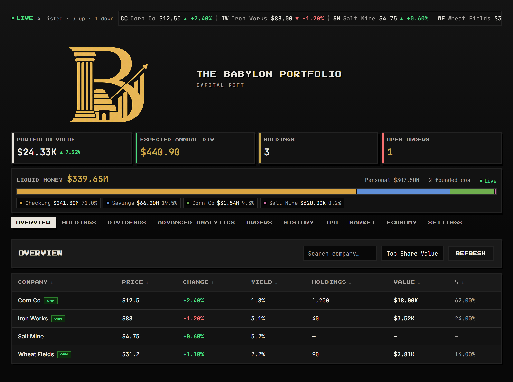

### Holdings & Portfolio Chart
Track your holdings with interactive portfolio value chart
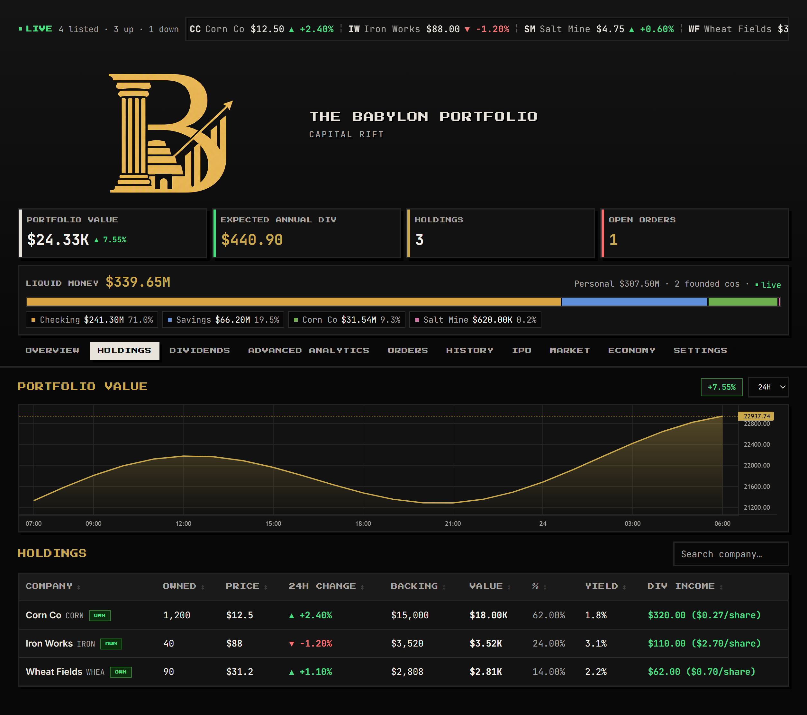

### Dividends
Dividend totals, expected annual income, and per-company breakdown
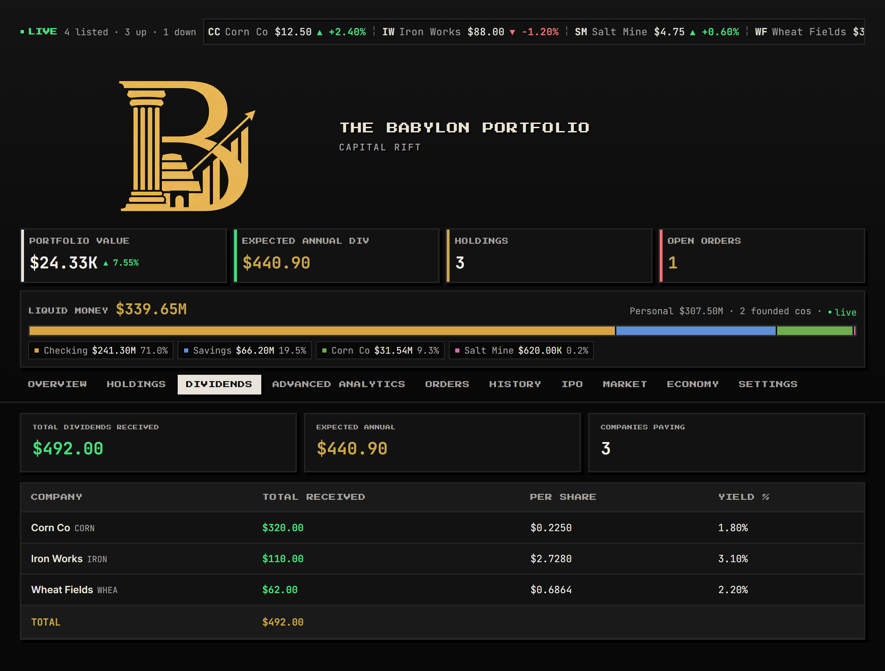

### Advanced Analytics
Sector map with the stock market overview cards and per-sector breakdown beneath it
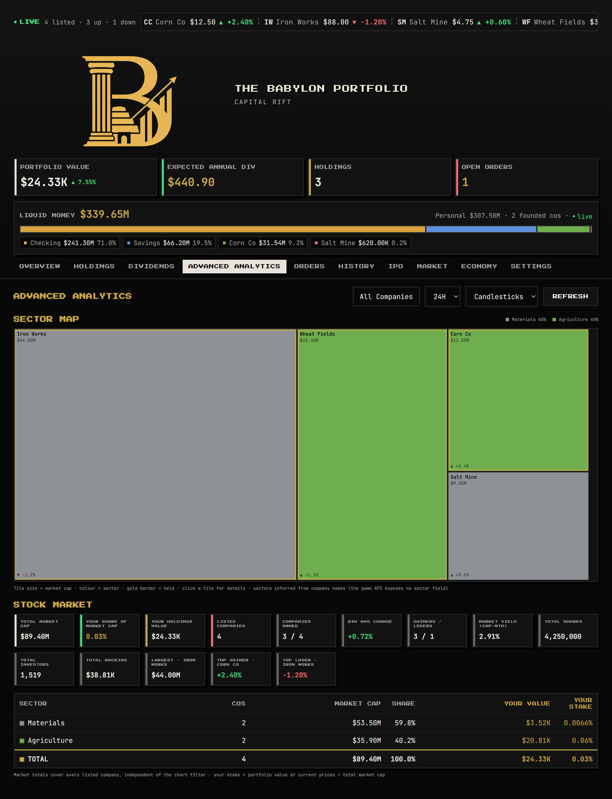

### Candlestick Charts
Full-width candlestick charts for every listed company across 1H and 24H timeframes
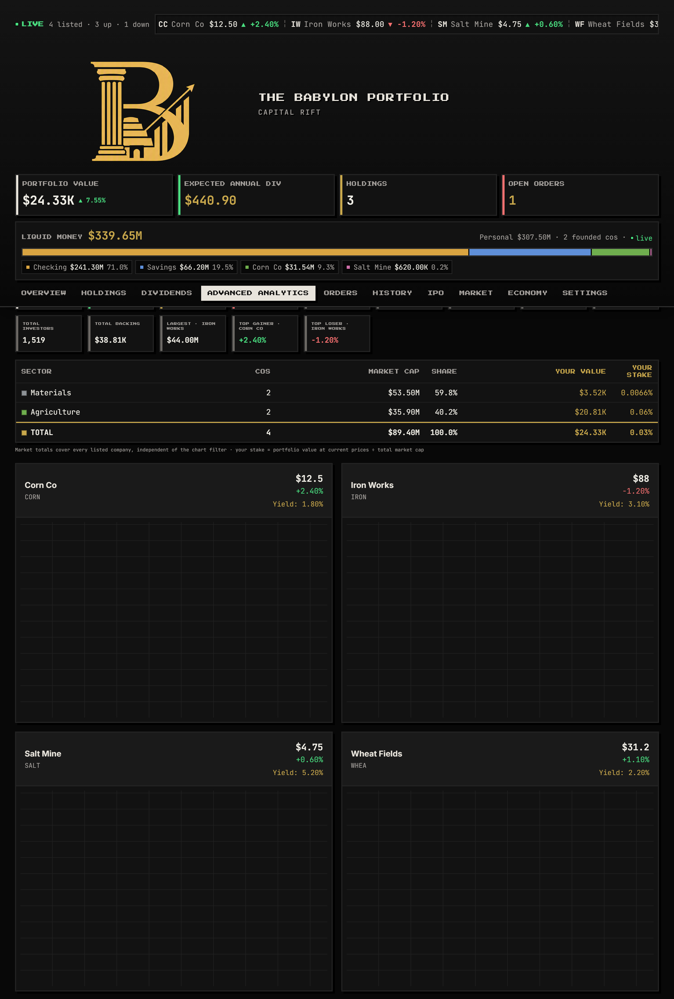

### Company Detail Overlay
Deep dive into individual companies with order book, spark line and dividend history
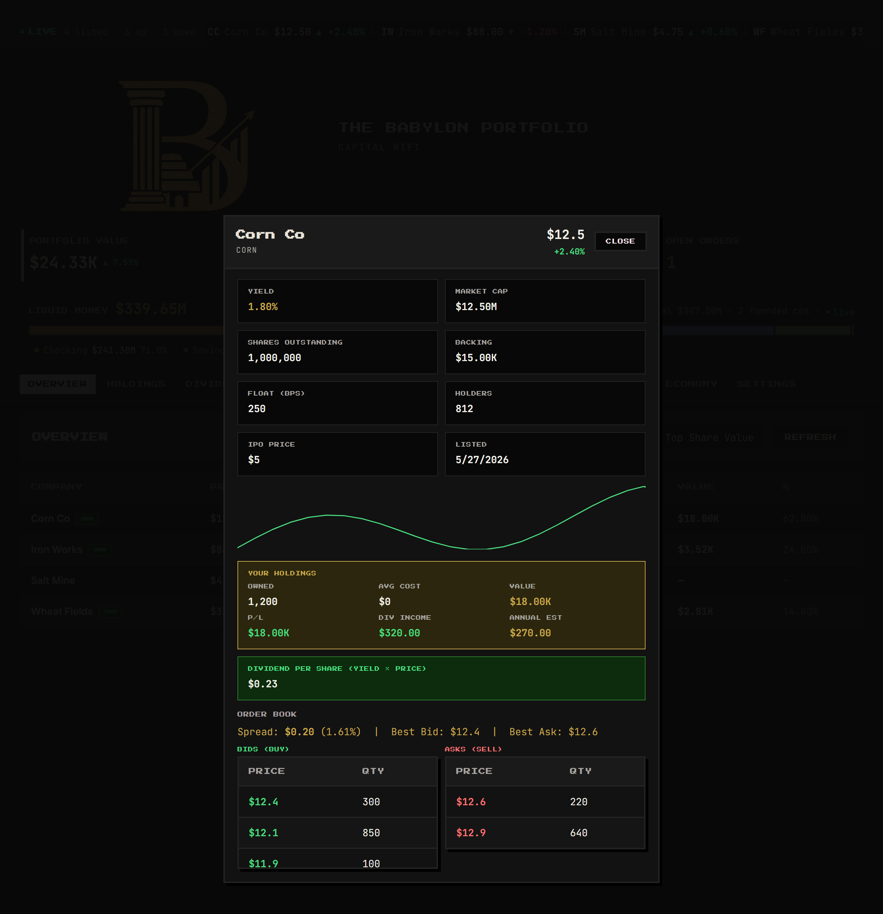

### Market Analysis
Full exchange scan with every commodity's price, 24h change, base price, spread, NPC quotes, best bid/ask, book depth, trend and volume
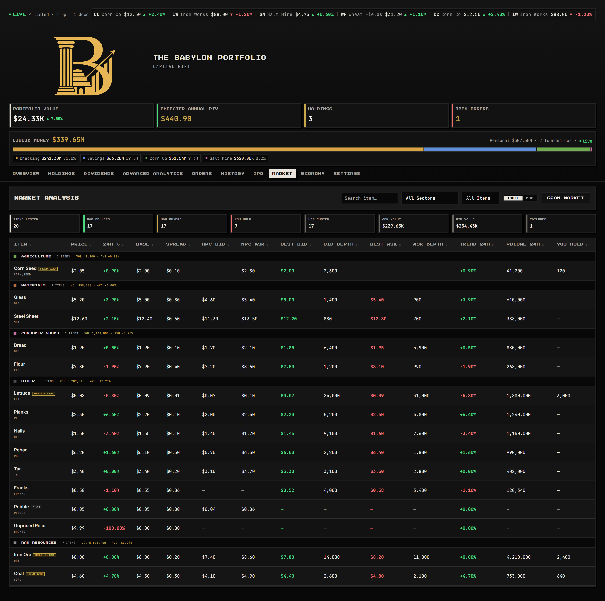

### History Tab
Complete log of the trades, orders and IPO bids detected on your account
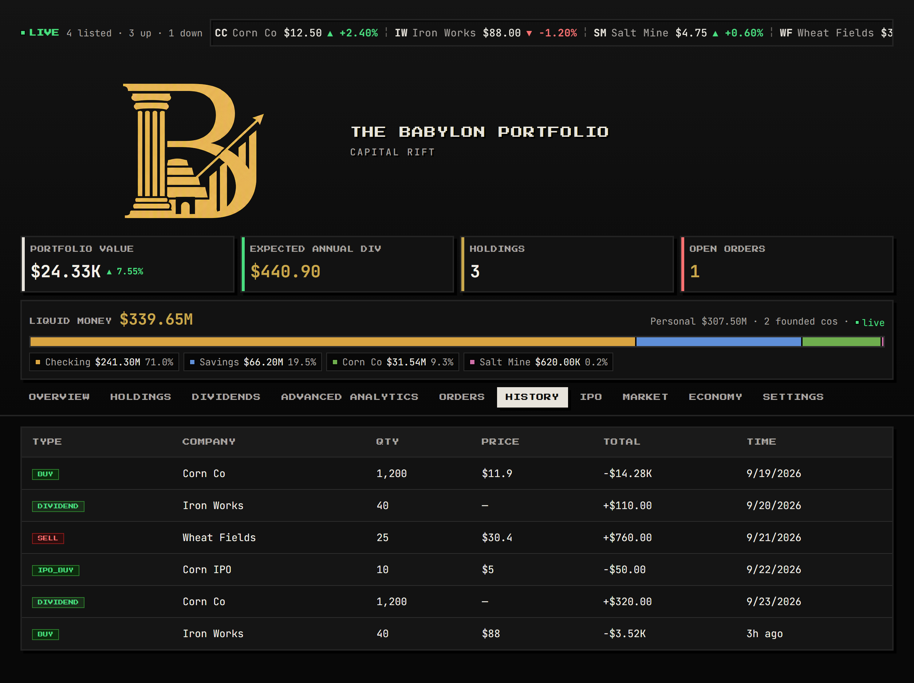

### Economy - World & Quotes
Game-day macro stats, cash supply, and commodity quotes
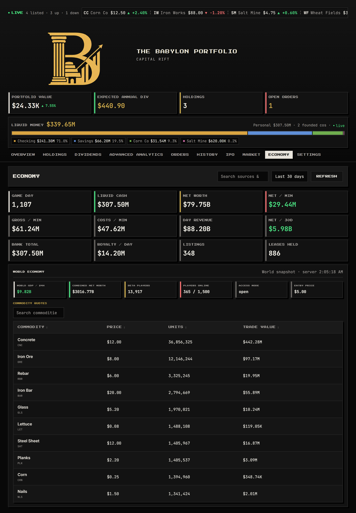

### Economy - Rates, Cash Flow & Sources
Income engine rates, daily inflow/outflow chart, and ranked income sources
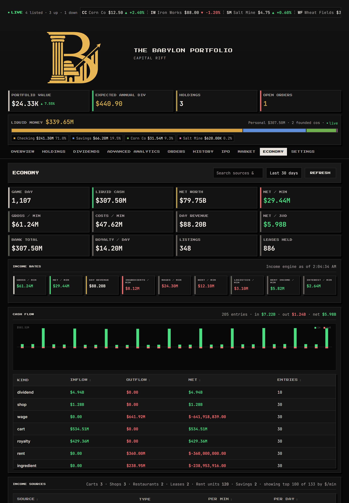

### Economy - Bank & Equity
Bank accounts, recent activity, and your equity per company (read-only)
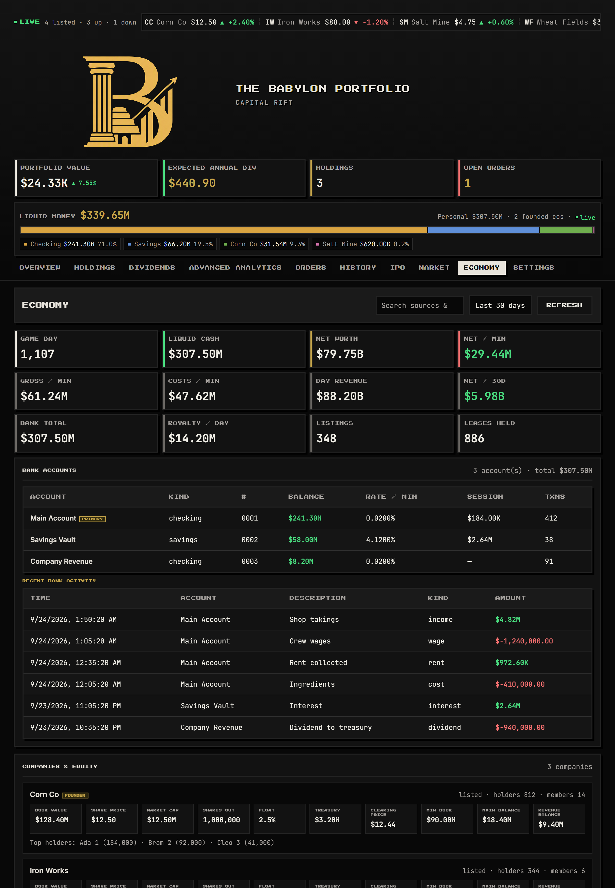

### Economy - Leaderboards & Market Pulse
Wealth and loyalty boards plus scan breadth with top gainers and losers
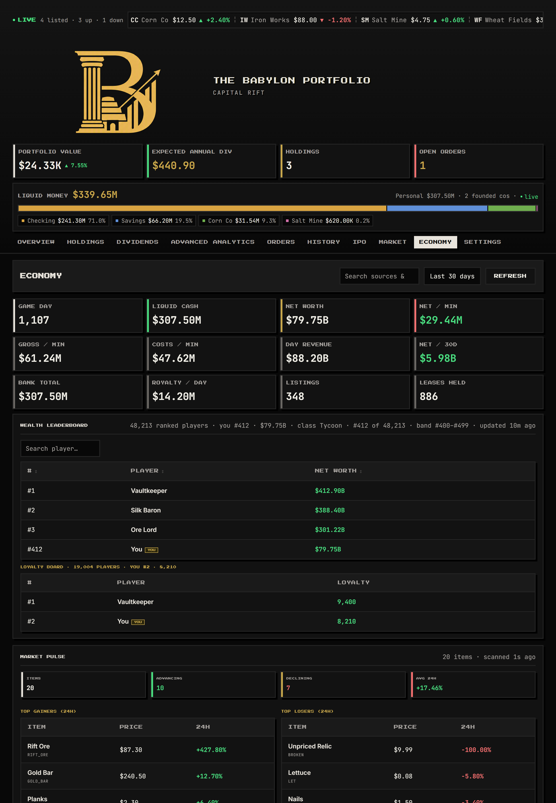

## Known Limitations

- **Spark Data**: API returns limited historical data (~24-72 points), restricting chart timeframes to 1H and 24H
- **Popup Size**: Fixed 800x600 dimensions for optimal display (use Full Tab mode for larger view)
- **API Rate Limits**: Respect Capital Rift's API rate limits to avoid throttling
- **Remote Viewer**: Requires Vercel deployment and KV database setup
- **No Discord Integration**: This build does not include webhook alerts or Discord exports — see the Premium edition for those
- **No Trading**: Buying, selling, cancelling orders and IPO bidding are deliberately absent. The trade endpoints in the service worker were removed, not just hidden — the messages are refused at the boundary, so no part of this build can place a mutation
- **Passive Detection**: Transactions appear after the next poll or the next time the popup loads, so a trade can take up to a minute to show up in History

## Future Enhancements

- [ ] Extended timeframe support (7D, 30D) when API allows
- [ ] Price alerts and notifications
- [ ] Dark/light theme toggle
- [ ] Multi-language support

## License

This project is licensed under the MIT License - see the [LICENSE](LICENSE) file for details.

## Disclaimer

This extension is an unofficial tool for Capital Rift. It is not affiliated with or endorsed by the Capital Rift development team. Use at your own risk. The extension is designed for educational and portfolio tracking purposes.

## Acknowledgments

- **Capital Rift** - The game that inspired this tool
- **TradingView** - Lightweight Charts library
- **Quest Trade** - UI design inspiration

---

Built with passion for portfolio management and retro gaming aesthetics.
